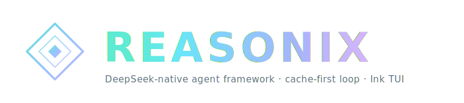

<p align="center">
  
</p>

<p align="center">
  <strong>English</strong>
  &nbsp;·&nbsp;
  <a href="./README.zh-CN.md">简体中文</a>
  &nbsp;·&nbsp;
  <a href="./docs/GUIDE.md">Guide</a>
  &nbsp;·&nbsp;
  <a href="./docs/SPEC.md">Spec</a>
  &nbsp;·&nbsp;
  <a href="https://esengine.github.io/DeepSeek-Reames Agent/">Website</a>
  &nbsp;·&nbsp;
  <strong><a href="https://discord.gg/XF78rEME2D">Discord</a></strong>
</p>

> [!IMPORTANT]
> **Reames Agent 1.0 is a ground-up rewrite in Go** — this branch (`main-v2`) is the new default and where development happens now.
> The earlier `0.x` TypeScript releases are **legacy**, living on the [`v1`](https://github.com/esengine/DeepSeek-Reames Agent/tree/v1) branch (maintenance only).
> See the **[migration guide](./docs/MIGRATING.md)**. `npm i -g reames-agent` stays the install command — `1.0.0`+ delivers the Go binary, `0.x` is the legacy TS build.

<p align="center">
  <a href="https://www.npmjs.com/package/reames-agent"></a>
  <a href="https://github.com/esengine/DeepSeek-Reames Agent/actions/workflows/ci.yml"></a>
  <a href="./LICENSE"></a>
  <a href="https://www.npmjs.com/package/reames-agent"></a>
  <a href="https://github.com/esengine/DeepSeek-Reames Agent/stargazers"></a>
  <a href="https://atomgit.com/esengine/DeepSeek-Reames Agent"></a>
  <a href="https://github.com/esengine/DeepSeek-Reames Agent/graphs/contributors"></a>
  <a href="https://github.com/esengine/DeepSeek-Reames Agent/discussions"></a>
  <a href="https://discord.gg/XF78rEME2D"></a>
</p>

<br/>

<h3 align="center">A DeepSeek-native AI coding agent for your terminal.</h3>
<p align="center">A config- and plugin-driven harness — a single static Go binary, tuned around DeepSeek's prefix cache so token costs stay low across long sessions.</p>

<br/>

> [!IMPORTANT]
> **Community · 加入社区** — bilingual Discord for setup help (`#help` / `#求助`), workflow showcases, and feature ideas. → **<https://discord.gg/XF78rEME2D>**

<br/>

## Features

- **Config-driven.** Providers, the agent, enabled tools, and plugins are all
  declared in `reames-agent.toml`. No hardcoded models.
- **Multi-model & composable.** DeepSeek ships as a preset; any
  OpenAI-compatible endpoint is a config entry, not new code. Optionally run
  two models together (executor + planner) in separate, cache-stable sessions.
- **Plugin-driven.** External tools run as subprocesses over stdio JSON-RPC
  (MCP-compatible). Built-in tools self-register at compile time.
- **Cache-aware context maintenance.** Startup injects a small stable environment
  summary, stale tool output is snipped/pruned before summary compaction, and the
  built-in tool schema contract is documented for regression review.
- **Zero-friction distribution.** `CGO_ENABLED=0` single binary; cross-compile
  to six targets with one command. The only dependency is a TOML parser.

## Install

```sh
npm i -g reames-agent                  # any OS; pulls the prebuilt native binary
brew install esengine/reames-agent/reames-agent   # macOS
```

Prebuilt archives (`darwin|linux|windows × amd64|arm64`) and `SHA256SUMS` are on
every [GitHub release](https://github.com/esengine/DeepSeek-Reames Agent/releases).

### Code signing

Windows builds are code-signed with a free certificate provided by the
[SignPath Foundation](https://signpath.org/), with signing through
[SignPath.io](https://signpath.io/).

### Build from source

```sh
make build      # -> bin/reames-agent(.exe)
make cross      # -> dist/ (darwin|linux|windows × amd64|arm64)
```

## Quick start

```sh
reames-agent setup                      # config wizard → ./reames-agent.toml
export DEEPSEEK_API_KEY=sk-...      # or let setup save it to Reames Agent home .env
reames-agent                            # then run /init to generate AGENTS.md (project memory)
reames-agent run "implement the TODOs in main.go"
reames-agent run --model deepseek-pro "add unit tests for this function"
echo "explain this code" | reames-agent run
```

## Configuration

A minimal `reames-agent.toml` — one provider and a default model — is enough to start:

```toml
default_model = "deepseek-flash"

[[providers]]
name        = "deepseek-flash"
kind        = "openai"
base_url    = "https://api.deepseek.com"
model       = "deepseek-v4-flash"
api_key_env = "DEEPSEEK_API_KEY"
```

Resolution order is **flag > `./reames-agent.toml` > the user config file >
built-in defaults**; starting with **Reames Agent v1.8.1**, the user file lives at
`~/.reames-agent/config.toml` on macOS/Linux and
`%AppData%\reames-agent\config.toml` on Windows. See
**[Configuration paths](./docs/CONFIG_PATHS.md)** for migration details and the
full `config.toml` / `.env` structure. Provider entries name secrets with
`api_key_env`; the secret values themselves live in Reames Agent's global
`<Reames Agent home>/.env`, shared by CLI and desktop. Project `.env` files are not
provider-key runtime fallbacks, but still feed workspace-scoped, non-provider
`${VAR}` expansion for MCP/plugin settings without importing Reames Agent control
variables. Permissions, the sandbox, plugins (MCP), slash
commands, `@` references, and two-model setup are all in the
**[Guide](./docs/GUIDE.md)**.

## Documentation

- **[Guide](./docs/GUIDE.md)** — configuration, permissions & sandbox, plugins
  (MCP), slash commands, `@` references, two-model collaboration.
- **[Bot guide](./docs/BOT_GUIDE.md)** — connect Feishu, Lark, and WeChat bots
  from the desktop app, then use approvals, YOLO, and commands from IM.
- **[Spec](./docs/SPEC.md)** — engineering contract: architecture, registries,
  data types, and roadmap.
- **[Task contracts & pause policy](./docs/TASK_CONTRACT.md)** — structure
  complex requests with context, output boundaries, constraints, and when to ask.
- **[Tool contract](./docs/TOOL_CONTRACT.md)** — provider-visible built-in tool
  names, read-only flags, and schema snapshot guard.
- **[Migrating from 0.x](./docs/MIGRATING.md)** — moving from the legacy
  TypeScript releases to the 1.0 Go rewrite.
- **[Checkpoints & rewind](./docs/CHECKPOINTS.md)** — the snapshot-based edit
  safety net (Esc-Esc / `/rewind`).

<br/>

## Star History

<a href="https://www.star-history.com/?repos=esengine%2FDeepSeek-Reames Agent&type=date&legend=top-left">
 <picture>
   <source media="(prefers-color-scheme: dark)" srcset="https://api.star-history.com/chart?repos=esengine/DeepSeek-Reames Agent&type=date&theme=dark&legend=top-left" />
   <source media="(prefers-color-scheme: light)" srcset="https://api.star-history.com/chart?repos=esengine/DeepSeek-Reames Agent&type=date&legend=top-left" />
   
 </picture>
</a>

<br/>

## Support

If Reames Agent has been useful and you'd like to say thanks, you can. It stays a coffee, not a contract — donations don't buy feature priority or change how issues get triaged.

- **International** — PayPal: [paypal.me/yuhuahui](https://paypal.me/yuhuahui)
- **国内** — 微信支付（扫码）

<p align="center">
  
</p>

<br/>

## Acknowledgments

A small list of folks whose work has shaped Reames Agent the most — measured
by both commit count and code volume. **Listed alphabetically, no ordering
of importance.** The full contributor graph is on
[GitHub](https://github.com/esengine/DeepSeek-Reames Agent/graphs/contributors).

- [**ctharvey**](https://github.com/ctharvey)
- [**dimasd-angga**](https://github.com/dimasd-angga) (Dimas D. Angga)
- [**Evan-Pycraft**](https://github.com/Evan-Pycraft)
- [**ForeverYoungPp**](https://github.com/ForeverYoungPp)
- [**GTC2080**](https://github.com/GTC2080) (TaoMu)
- [**kabaka9527**](https://github.com/kabaka9527)
- [**lisniuse**](https://github.com/lisniuse) (Richie)
- [**wade19990814-hue**](https://github.com/wade19990814-hue)
- [**wviana**](https://github.com/wviana) (Wesley Viana)

Also a separate thank-you to [**Bernardxu123**](https://github.com/Bernardxu123)
for designing the project logo, and to
[AIGC Link](https://xhslink.com/m/80ngts127cA) for promoting the project on XiaoHongShu.

<p align="center">
  <a href="https://github.com/esengine/DeepSeek-Reames Agent/graphs/contributors">
    
  </a>
</p>

<br/>

---

<p align="center">
  <sub>MIT — see <a href="./LICENSE">LICENSE</a></sub>
  <br/>
  <sub>Built by the community at <a href="https://github.com/esengine/DeepSeek-Reames Agent/graphs/contributors">esengine/DeepSeek-Reames Agent</a></sub>
</p>
