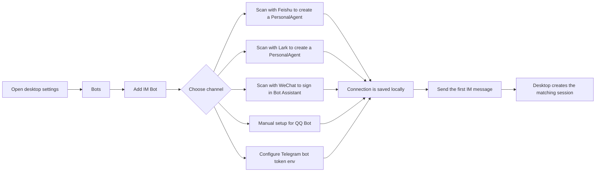
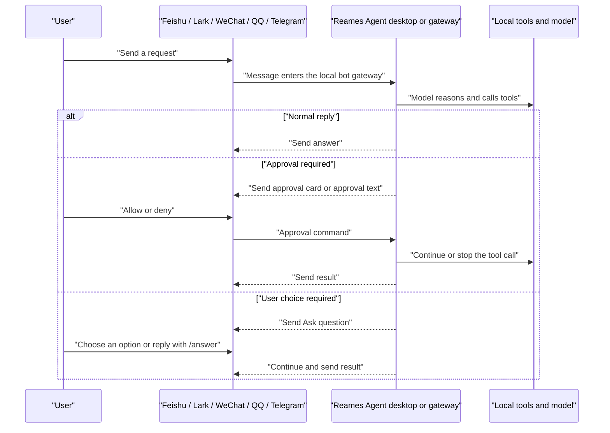
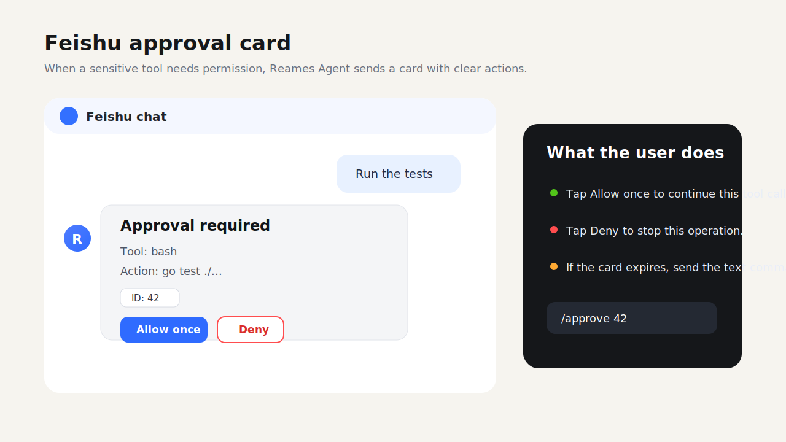
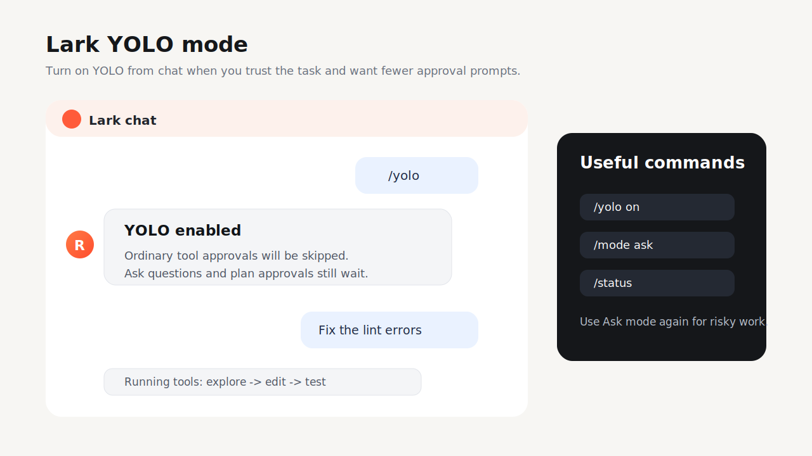
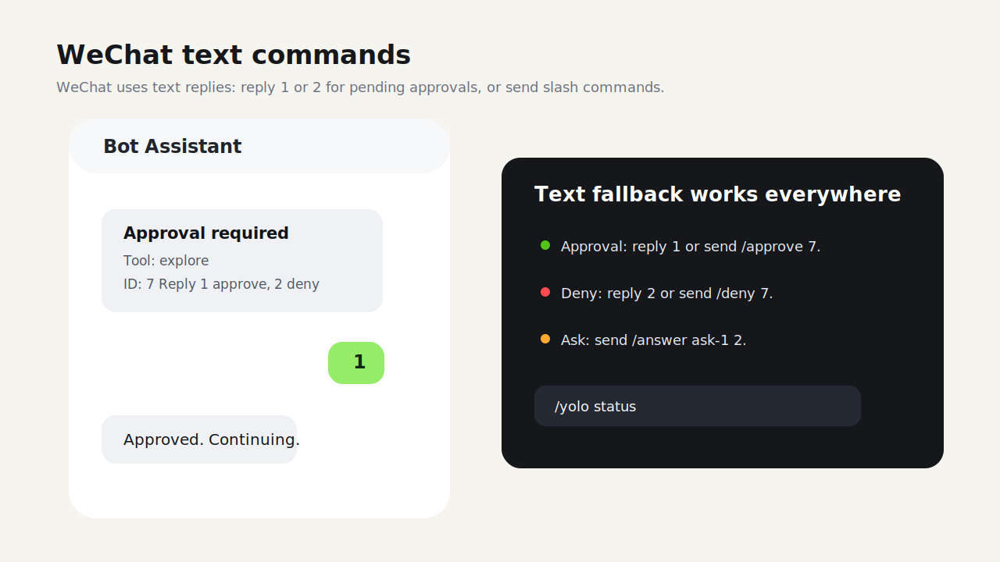
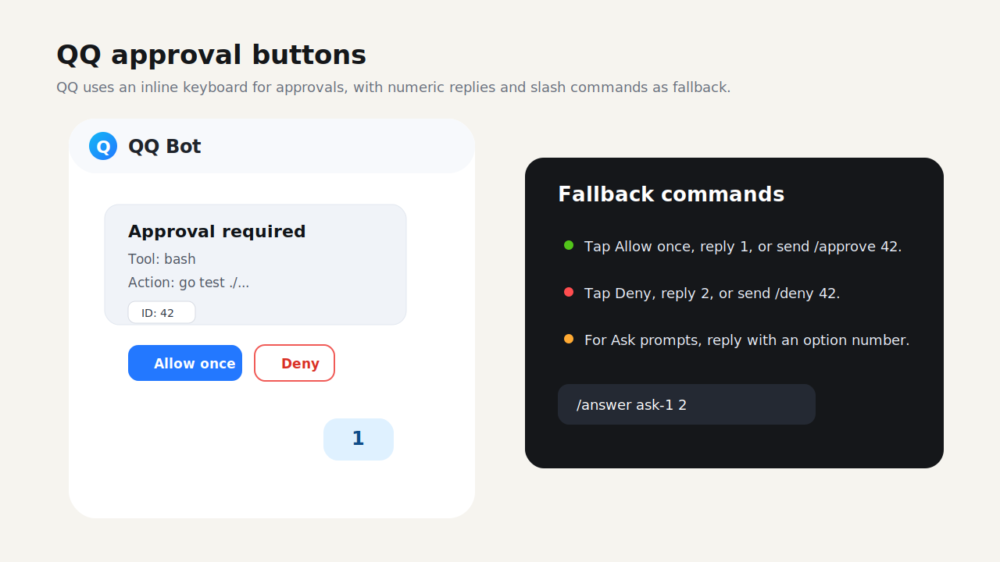
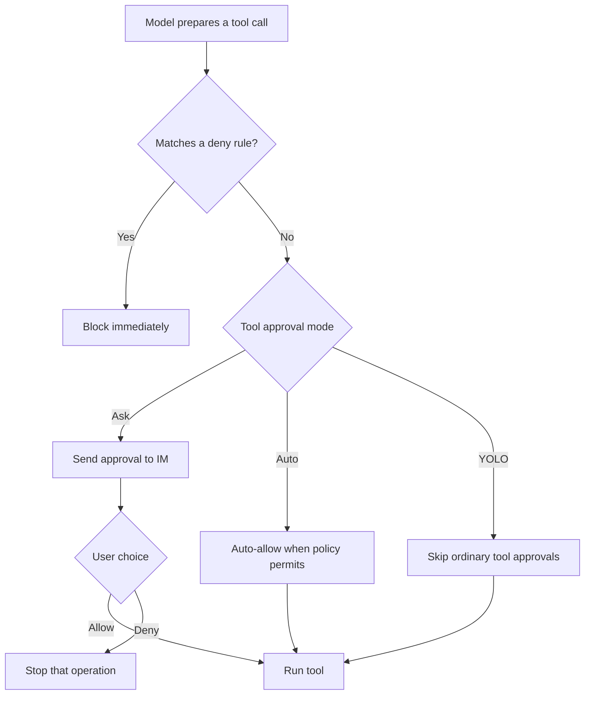

# Reames Agent Bot Guide

<a href="../README.md">README</a>
&nbsp;·&nbsp;
<a href="./BOT_GUIDE.zh-CN.md">简体中文</a>
&nbsp;·&nbsp;
<a href="./GUIDE.md">General guide</a>

> For desktop and CLI users. This guide explains how to connect Feishu, Lark,
> WeChat, QQ, and Telegram bots, how to use Reames Agent from IM, and how approvals, Ask
> questions, YOLO, and bot commands work.

## Contents

- [What the bot does](#what-the-bot-does)
- [Where it runs](#where-it-runs)
- [Connect the five channels](#connect-the-five-channels)
- [Run the bot headlessly](#run-the-bot-headlessly)
- [Usage flow](#usage-flow)
- [Channel interaction differences](#channel-interaction-differences)
- [Command quick reference](#command-quick-reference)
- [Approvals and YOLO](#approvals-and-yolo)
- [Do upgrades require rebinding?](#do-upgrades-require-rebinding)
- [Troubleshooting](#troubleshooting)

## What the bot does

After a bot is connected, you can send Reames Agent messages from Feishu, Lark,
WeChat, QQ, or Telegram. The desktop app or `reames-agent gateway run` process handles the
model, tools, permissions, sandboxing, and local context, then sends progress
and results back to the IM channel.

Common uses:

- Ask Reames Agent to inspect code, read docs, explain errors, or summarize findings.
- Trigger tool calls from IM and receive progress or final results in the chat.
- Approve or deny sensitive actions such as file writes or shell commands.
- Enable YOLO for trusted temporary work so ordinary tool approvals are skipped.
- Open the matching desktop IM session to inspect context, cost, tokens, and tool
  traces.

## Where it runs

The bot gateway is a shared Go runtime. The same core behavior works on
Windows, macOS, and Linux; platform differences mostly come from each IM
provider's credentials, network reachability, callback/WebSocket setup, and
saved local account state.

There are two supported entry points:

- **Desktop runtime**: configure bots in **Settings -> Bots**. The desktop app
  starts the gateway, keeps status in the app, persists per-connection tool
  approval mode changes, and lets you open matching local IM sessions.
- **CLI runtime**: run `reames-agent gateway run` for a headless long-lived process.
  `reames-agent bot start` remains as a compatibility alias for the old naming.
  It uses the same config, allowlist, routes, queue settings, pairing store,
  adapters, and project/session index as the desktop runtime.

The normal `reames-agent run` command does not automatically start the IM gateway.
Remote bot behavior is active only while the desktop bot runtime is running or
while a `reames-agent gateway run` process is alive.

## Connect the five channels

Open the Reames Agent desktop app and go to **Settings -> Bots**. In **Add IM Bot**,
choose a channel and scan the QR code.



### Feishu

1. In **Settings -> Bots -> Add IM Bot**, choose **Feishu**.
2. Generate a QR code.
3. Scan it with Feishu and finish authorization.
4. Wait until the page shows the connection as connected.
5. Send the bot a message such as `hello` or `please inspect this error`.

### Lark

1. In **Settings -> Bots -> Add IM Bot**, choose **Lark**.
2. Generate a QR code.
3. Scan it with Lark and finish authorization.
4. Wait until the page shows the connection as connected.
5. Send the Lark bot a message.

Feishu and Lark share the same capability set, but they are saved as separate
connections. You can give them different models, working directories, or tool
approval modes. Bot text replies are sent as standalone Interactive Card JSON
2.0 markdown, which avoids Feishu/Lark platform quote prefixes while preserving
CommonMark formatting. If a card is too large for the platform limit, Reames Agent
falls back to plain text automatically.

For webhook mode, configure a verification token. Incoming webhook events are
verified fail-closed: an empty or missing configured token rejects callers
instead of silently opening the webhook.

### WeChat

1. In **Settings -> Bots -> Add IM Bot**, choose **WeChat**.
2. Generate a QR code.
3. Scan it with WeChat to sign in to Bot Assistant.
4. Wait until the page shows the connection as connected.
5. Send the WeChat bot a message.

WeChat does not provide interactive card buttons here, so approvals use numeric
or text commands. Ask questions can be answered by replying with normal text,
option numbers, or `/answer <id> <answer>`.

### QQ

1. In **Settings -> Bots -> Add IM Bot**, choose **QQ**.
2. Fill in the **App ID** and **App Secret** (or set the env var `QQ_BOT_APP_SECRET`).
3. Click **Save** to store the credentials.
4. Wait until the page shows the connection as connected.
5. Send the QQ bot a message.

QQ Bot uses the official QQ Bot platform API. It supports inline keyboard
buttons for approvals. Ask questions are sent as text; reply with normal text,
option numbers, or `/answer <id> <answer>`. When a button expires or the
platform reports an action failure, copy the ID shown in the card and send the
equivalent text command.

QQ does not support QR-code scanning for connection setup. You must configure
the App ID and App Secret manually. The adapter reads only the configured
`app_secret_env` value; it does not fall back to an unrelated `QQ_SECRET`
environment variable. QQ and WeChat HTTP calls use bounded clients so a stalled
provider request cannot block the gateway indefinitely.

### Telegram

Telegram uses the official Bot API with long polling. Create a bot with
BotFather, place the token in an environment variable such as
`TELEGRAM_BOT_TOKEN`, then create the connection with the CLI configuration
flow. The desktop app can inspect or edit the token environment-variable name,
run diagnostics, and send a real test message, but it does not claim a
one-click Telegram installation flow.

```sh
export TELEGRAM_BOT_TOKEN="<bot token>"
reames-agent gateway setup --home ~/.reames-agent --channel telegram \
  --token-env TELEGRAM_BOT_TOKEN --workspace /path/to/project --pairing
reames-agent gateway doctor --deep --home ~/.reames-agent
reames-agent gateway run --channels telegram --dir /path/to/project
```

The token value is never written to TOML or the delivery ledger. Remote Bot API
URLs must use HTTPS; plain HTTP is accepted only for localhost test fixtures.
Startup validates the token with `getMe`. The polling loop has a request
deadline, bounded exponential backoff, cancellable stop, and can restart after
stop without allowing concurrent duplicate starts.

## Run the bot headlessly

The desktop app is the easiest way to create and test bot connections, but the
runtime itself can also run as a long-lived headless gateway:

```sh
reames-agent gateway setup --home ~/.reames-agent --channel feishu \
  --app-id APP_ID --app-secret-env FEISHU_BOT_APP_SECRET \
  --workspace /path/to/project --pairing --dry-run
reames-agent gateway setup --home ~/.reames-agent --channel feishu \
  --app-id APP_ID --app-secret-env FEISHU_BOT_APP_SECRET \
  --workspace /path/to/project --pairing
reames-agent bot doctor
reames-agent bot doctor --deep
reames-agent gateway doctor --deep --home ~/.reames-agent
reames-agent gateway run --channels qq,feishu,lark,weixin,telegram --dir /path/to/project
reames-agent gateway install --dry-run --home ~/.reames-agent --channels feishu --dir /path/to/project
reames-agent gateway install --start-now --home ~/.reames-agent --channels feishu --dir /path/to/project
reames-agent gateway install --start-now --watchdog-sec 60s --home ~/.reames-agent --channels feishu --dir /path/to/project
```

`gateway setup` is the headless configuration entrypoint for `feishu`, `lark`,
`qq`, `weixin`, and `telegram`. Feishu/Lark/QQ use `--app-id` and
`--app-secret-env`; WeChat uses `--account-id` and `--token-env`; Telegram uses
`--token-env`. Secret options accept only
conventional uppercase environment-variable names. Secret values are never
accepted on the command line or written to the config. Use `--connection-id`
for a stable multi-instance ID and `--workspace`, `--model`, and
`--tool-approval ask|auto|yolo` for per-connection defaults.

Access must be explicit: choose `--pairing`, `--users`, `--groups`,
`--approvers`, `--admins`, or deliberately pass `--allow-all`. List flags can
be repeated or comma-separated. Updates merge and preserve existing access by
default; use `--reset-access` together with replacement rules to narrow an old
open configuration. A new connection without an explicit rule fails closed.

`--dry-run` strictly parses the existing TOML, validates credential references
and access boundaries, and prints a stable redacted plan without creating or
rewriting files. Applying the plan uses atomic replacement and idempotent
connection-ID updates. Other connections, providers, routes, `created_at`,
session mappings, and untouched access remain intact; an identical rerun does
not refresh `updated_at` or rewrite the file. Malformed config fails without
being replaced by defaults.

Use `--channels` to choose which configured IM inputs to accept. `feishu` and
`lark` select the matching Feishu-family connection; `weixin` selects the saved
WeChat iLink account; `qq` selects the configured QQ bot; `telegram` selects the
configured Telegram bot. Use `--dir` to attach
incoming messages to a project workspace and `--model` to override the default
model for this process.

`gateway doctor` is the recommended headless spelling for the same diagnostics
as `bot doctor`: it checks configuration, credential environment variables,
access control, connection records, queue settings, and pairing state without
starting the gateway or printing secret values. Use `--home PATH` to inspect the
same `REAMES_AGENT_HOME` that a background Gateway service will use.

On Linux systemd, `gateway install` accepts an optional `--watchdog-sec 60s`.
The default `0` keeps `Type=simple`; a positive value uses `Type=notify`, sends
`READY=1` only after recovery preflight and at least one adapter start, feeds
`WATCHDOG=1` only while an adapter remains running/degraded, and sends
`STOPPING=1` before a bounded shutdown. The minimum is two seconds and the flag
is rejected on launchd, Windows Scheduled Task, or non-install operations. This
is local process/adapter-state evidence, not proof that a real IM service is
reachable; production deployments still need a real channel round trip.

The headless gateway uses the same config records as the desktop app:

- `[[bot.connections]]` identifies each IM input. `provider` is the adapter
  family (`feishu`, `weixin`, `qq`, or `telegram`), while `domain` distinguishes variants
  such as Feishu vs Lark.
- `credential.app_id`, `credential.app_secret_env`, `credential.account_id`,
  and `credential.token_env` point to app IDs, app secrets, saved accounts, and
  tokens. Secrets stay in environment variables or the Reames Agent user credentials
  store.
- `workspace_root`, `model`, and `tool_approval_mode` can be set per
  connection. This lets different IM channels route to different local projects
  or approval postures.
- `access` can also be set per connection with `enabled`, `allow_all`,
  `pairing_enabled`, `users`, `groups`, `admins`, and `approvers`. When a
  connection has active access settings, they are checked before the legacy
  global `[bot.allowlist]`.
- `[[bot.routes]]` adds finer routing by connection, platform, chat type, chat
  ID, user ID, or thread ID. Empty match fields are wildcards; the first matching
  route wins and can override `workspace_root`, `model`, and
  `tool_approval_mode`.
- `session_mappings` are filled from inbound messages with the remote chat ID
  and scope. The desktop UI can open the matching conversation once the mapping
  also has a local `session_id` target, such as a saved `path:` session target
  from a desktop-managed bot runtime or a manually configured mapping.
- The bot's project/session index is intentionally bounded to configured
  `workspace_root` values, route workspaces, active bot sessions, and saved
  `session_mappings`. Commands such as `/use project` and `/attach session`
  can only jump to those indexed targets; arbitrary local directories are not
  accepted from IM text.

Access control is still mandatory. New desktop-created bots should normally set
access inside that bot's own detail panel, which saves to `[[bot.connections]]`
or `[bot.qq].access`. The legacy global `[bot.allowlist]` remains a fallback for
older configs and for connections without active per-bot access. You can
deliberately set `allow_all = true`, or enable `pairing_enabled` for a single
bot / `[bot.pairing]` globally so an unknown DM sender receives a one-time
pairing code. That code must be approved locally with
`reames-agent bot pairing approve <code>` before the sender can drive the bot; when
the request is tied to a connection, approval adds the sender to that
connection's access list. Users listed in `admins` / `approvers` or the legacy
`*_admins` / `*_approvers` also receive base bot admission, so they do not need
to be duplicated in `users` / `*_users`. Group chats are not opened by DM
pairing or role admission; group IDs remain an additional narrowing layer.
Use these commands to manage pending requests:

```sh
reames-agent bot pairing list
reames-agent bot pairing approve CODE
reames-agent bot pairing reject CODE
```

If `qq_admins`, `feishu_admins`, `weixin_admins`, `telegram_admins`, or the matching
`*_approvers` lists are configured, `/yolo` and `/mode` are admin-only while
`/projects`, `/use project`, `/sessions`, `/attach session`, and `/search all`
are also admin-only. `/approve` and `/deny` require an approver or admin. When
no role lists are set, existing allowlisted users keep the previous command
behavior for compatibility. Remote users go through the same controller,
permission policy, tool approval mode, and sandbox rules as local desktop or CLI
turns.

```toml
[bot.allowlist]
enabled = true
feishu_users = ["ou_member"]
feishu_admins = ["ou_admin"]
feishu_approvers = ["ou_approver"]
```

`ignore_self_messages = true` is enabled by default. The gateway remembers the
platform `message_id` values it just sent and ignores matching echo events. If a
platform does not echo the same message ID reliably, configure the bot's own user
IDs under `[bot.self_user_ids]` as a second layer of loop protection. `/status`
and `/current` include the current queue mode and adapter health, such as
`feishu-lark=running` or `weixin-weixin=degraded`.

The optional `[bot.control]` section exposes a local loopback HTTP API and is
disabled by default. When enabled, `token_env` must point to an environment
variable and every request must include `Authorization: Bearer <token>`. The
server only binds to `localhost`, `127.0.0.1`, or `::1`. Current endpoints are
`GET /status` for session and adapter health snapshots, `GET /metrics` for
Prometheus text metrics, and `POST /send` for sending text or media through a
configured connection.

Example:

```sh
export REAMES_AGENT_BOT_CONTROL_TOKEN="change-me"

curl -H "Authorization: Bearer $REAMES_AGENT_BOT_CONTROL_TOKEN" \
  http://127.0.0.1:37913/status

curl -X POST http://127.0.0.1:37913/send \
  -H "Authorization: Bearer $REAMES_AGENT_BOT_CONTROL_TOKEN" \
  -H "Content-Type: application/json" \
  -d '{
    "connection_id": "feishu-lark",
    "domain": "lark",
    "chat_id": "oc_xxx",
    "chat_type": "dm",
    "text": "hello from local control API"
  }'
```

The Gateway keeps a mode-0600 atomic schema-v2 delivery ledger at
`<Reames Agent home>/bot/delivery-ledger.json`. It stores remote inbound identity,
state, opaque adapter recovery cursors, and—after a successful Agent turn—the
final text chunks required to resume an outbound reply without running the model
again. It never stores inbound message text, attachments, tool data, approval/ask
cards, progress messages, or raw errors. Each outbound obligation is limited to
1 MiB and 512 text chunks; the whole ledger remains limited to 4 MiB. A
long-lived OS file lock makes a second CLI Gateway or Desktop bot writer fail
closed. `/status`, control `/status`, and `/metrics` expose counts only, never
remote IDs, cursor values, the local path, or final-response text.

The built-in Feishu, QQ, Weixin, and Telegram adapters already use durable
claim/dedupe and the final-delivery gate. Telegram additionally maps
`update_id` to the durable delivery identity and only advances the remote
polling offset after the final reply was sent and the delivery ledger commit
succeeded. Weixin applies the same rule to its native `get_updates_buf`: the
opaque buffer is atomically persisted in a mode-0600 poll-state file only after
every inbound message in that batch was durably settled. Failure, cancellation,
or a state-write error keeps the previous buffer for replay. A manually configured Weixin `account_id` that is unsafe as
a cross-platform filename is mapped to a stable digest and cannot escape `weixin/accounts`. Before each final text chunk
is sent, the Gateway persists an
`attempting` state. A platform acknowledgement advances `next_chunk`; the last
acknowledgement atomically removes the obligation, settles every merged inbound
claim, and advances the contiguous cursor/Telegram offset. A duplicate inbound
event that owns an existing obligation resumes that exact reply and does not
create a Controller or run the model again. Feishu and QQ do not yet page message
history missed while the process was completely offline; Weixin and Telegram
still depend on the platform's real retention window. Full offline recovery
therefore requires platform-specific history/resume semantics and real application
credentials. A saturated live-adapter queue now backpressures the platform reader
or exits on service cancellation instead of silently dropping an envelope before
the durable claim. Delivery is explicitly at-least-once. A
crash after a platform accepted a chunk but before the local acknowledgement was
committed is ambiguous, so recovery conservatively resends that unconfirmed
chunk with a visible warning that it may be a duplicate. Chunks whose
acknowledgements were durably committed are not resent. A purely `pending`
obligation has never been attempted and is recovered without the warning.
Queued messages keep their individual durable claims even when `collect`
merges them, a queue-cap policy summarizes or drops an older entry, or an
explicit interrupt/reset supersedes pending work. The Gateway settles those
claims only with the corresponding delivered response or cancellation
acknowledgement.

## Usage flow



The **Bots** entry in the desktop sidebar lists connected bots. After the first
IM message arrives, you can open the matching local session from there to inspect
context, tool traces, cost, and runtime metrics.

## Channel interaction differences

The following images are synthetic examples. They show the interaction shape
without exposing real account IDs, local paths, or private chat content.









| Channel | Connection | Approval | Ask questions | Best for |
| --- | --- | --- | --- | --- |
| Feishu | Scan to create a PersonalAgent | Interactive card buttons, or commands | Interactive card buttons, or commands | Feishu workspaces, DMs, and groups |
| Lark | Scan to create a PersonalAgent | Interactive card buttons, or commands | Interactive card buttons, or commands | International Lark workspaces |
| WeChat | Scan with WeChat | Reply `1` / `2`, or commands | Reply with normal text, option numbers, or commands | Lightweight personal/mobile testing |
| QQ | Manual setup (App ID + App Secret) | Inline keyboard buttons, numeric replies, or commands | Reply with normal text, option numbers, or commands | QQ groups, DMs, and official QQ Bot platform |
| Telegram | BotFather token via environment variable | Text commands and numeric replies | Reply with normal text, option numbers, or commands | Telegram DMs/groups and durable long-polling deployments |

Feishu and Lark card buttons are converted into commands such as
`/approve <id>`, `/deny <id>`, or `/answer <id> <option>`. QQ approval buttons
work the same way. If a button expires or the platform reports an action
failure, copy the ID shown in the card and send the equivalent text command.

## Command quick reference

These commands work in Feishu, Lark, WeChat, QQ, and Telegram.

| Command | Purpose | Example |
| --- | --- | --- |
| `/help` | Show available commands | `/help` |
| `/status` | Show active tasks, queue state, tool approval mode, and adapter health | `/status` |
| `/current` | Alias for `/status`, useful for a quick mobile check-in | `/current` |
| `/stop` | Stop the current task | `/stop` |
| `/new` | Start a fresh session | `/new` |
| `/reset` | Reset the current session | `/reset` |
| `/approve <id>` | Approve a pending operation | `/approve 1` |
| `/deny <id>` | Deny a pending operation | `/deny 1` |
| `/answer <id> <option>` | Answer an Ask question | `/answer ask-1 2` |
| `/yolo` | Enable YOLO | `/yolo` |
| `/yolo on` | Enable YOLO | `/yolo on` |
| `/yolo off` | Return to Ask mode | `/yolo off` |
| `/yolo auto` | Switch to Auto approval mode | `/yolo auto` |
| `/yolo status` | Show the current tool approval mode | `/yolo status` |
| `/mode yolo` | Switch to YOLO | `/mode yolo` |
| `/mode ask` | Switch to Ask mode | `/mode ask` |
| `/mode auto` | Switch to Auto mode | `/mode auto` |
| `/queue status` | Show the current queue mode | `/queue status` |
| `/queue steer` | Treat mid-run messages as guidance for the current task | `/queue steer` |
| `/queue followup` | Queue mid-run messages as later turns | `/queue followup` |
| `/queue collect` | Merge queued messages into one later turn | `/queue collect` |
| `/queue interrupt` | Cancel the current task and keep the newest message | `/queue interrupt` |
| `/projects [query]` | List indexed project workspaces | `/projects reames-agent` |
| `/use project <id\|name>` | Route this remote session to an indexed project | `/use project p1` |
| `/use project default` | Clear the project override and return to configured routing | `/use project default` |
| `/sessions search <query>` | Search indexed desktop/bot sessions | `/sessions search release bug` |
| `/attach session <id\|query>` | Continue this remote session from an indexed `path:` transcript | `/attach session s1` |
| `/search all <query>` | Search file contents across indexed project roots | `/search all TODO` |

Shortcut replies:

- When an approval is pending, reply `1` to approve and `2` to deny.
- When an Ask question is pending, reply with any normal non-slash text. Option
  numbers still work for choice questions.
- Slash commands such as `/stop`, `/mode`, or `/answer ...` are not captured as
  Ask shortcut replies.
- If there is no pending operation, `1` / `2` are treated as normal text or
  produce guidance.

The default queue mode is `steer`: when the same session is already running, a
new message is injected as mid-turn guidance instead of waiting for the whole
turn to finish. `queue_cap` and `queue_drop` bound backlog growth in config.
`reames-agent bot doctor --deep` reports queue, pairing, and role diagnostics.

Queue modes:

- `steer`: mid-run messages become guidance for the current turn when possible.
- `followup`: mid-run messages are queued as later turns.
- `collect`: queued messages are merged into one later turn.
- `interrupt`: the active turn is canceled and the newest message is kept as the
  next turn.

Project and session navigation:

- `/projects [query]` lists workspaces from configured bot routes, connection
  workspaces, active bot sessions, and saved session mappings.
- `/use project <id|name>` pins the current remote session to one indexed
  project. `/use project default` clears the override.
- `/sessions search <query>` searches indexed desktop and bot session metadata.
- `/attach session <id|query>` continues the remote session from an indexed
  `path:` transcript.
- `/search all <query>` searches file contents across indexed project roots.
  Reames Agent uses `rg` when available and falls back to a bounded Go scanner.

These navigation commands never accept arbitrary paths typed from IM. They only
jump to indexed targets and, when role lists are configured, require an admin.

When an adapter supplies media URLs, the gateway downloads those files into the
current workspace's `.reames-agent/attachments` directory and passes them to
Reames Agent as `@.reames-agent/attachments/...` references. If an attachment cannot be
saved, the bot sends a short warning and continues with the available text. The
built-in Feishu, Weixin, QQ, and Telegram adapters currently focus on text events; ordinary
IM attachment extraction can be added at the adapter layer.

## Approvals and YOLO

Reames Agent bots use the same permission system as the desktop app. Ask mode is the
default: sensitive tool calls such as file writes and shell commands request
confirmation first.



YOLO boundaries:

- YOLO skips ordinary tool approval prompts.
- YOLO does not bypass hard `deny` rules.
- YOLO does not answer model Ask questions for you.
- YOLO does not approve plan-mode plan approvals for you.

Recommendations:

- Use `/yolo` for temporary trusted debugging or fast local iteration.
- Use `/mode ask` for risky work, production code, or anything uncertain.
- Use `/mode auto` when you want fewer routine prompts while keeping policy
  decisions.

## Do upgrades require rebinding?

No. A normal Reames Agent app upgrade or overwrite install does not require
rebinding.

Bindings are stored in the user's Reames Agent data, not inside the app bundle:

- Bot connections, remote IDs, allowlists, model choices, and approval modes are
  stored in the user config.
- Feishu and Lark secrets are stored in Reames Agent's global
  `<Reames Agent home>/.env`, shared by CLI and desktop.
- The WeChat scanned account token and an opaque poll cursor containing no
  message text or user identity are stored in the Reames Agent user data
  directory; the cursor uses an atomic mode-0600 file.
- The QQ App ID is stored in user config; the App Secret is stored under the
  configured env var, `QQ_BOT_APP_SECRET` by default, in the global credentials
  file.

You may need to bind again if:

- The Reames Agent user config directory was deleted.
- You changed machines or OS users.
- Authorization was revoked on the platform side.
- The WeChat token expired.
- Feishu or Lark app secrets were cleared.
- The QQ App ID changed, or the configured QQ App Secret env var was cleared.

## Troubleshooting

| Symptom | What to check |
| --- | --- |
| QR code says the link expired | Generate a new QR code in Settings; QR codes expire (Feishu, Lark, WeChat only — QQ uses manual setup and has no QR code). |
| Connected but no reply | Make sure the desktop bot runtime or `reames-agent gateway run` process is running, the bot connection is enabled, and the sender ID is allowlisted, paired, or access is open. |
| Feishu or Lark button action fails | Send the text command from the card, such as `/approve <id>` or `/deny <id>`. |
| QQ button action fails | Same as Feishu/Lark — send the text command from the card, such as `/approve <id>` or `/deny <id>`. |
| WeChat reply `1` does nothing | Numeric shortcuts only work when an approval or Ask is pending; use the full command if needed. |
| QQ reply `1` does nothing | Same as WeChat — numeric shortcuts only work when an approval or Ask is pending; use the full command if needed. |
| Need to confirm the current mode | Send `/status`, `/current`, or `/yolo status`. |
| Need a fresh context | Send `/new` or `/reset`. |
| Need to stop the current task | Send `/stop`. |

If connectivity still fails, open the connection's advanced settings in
**Settings -> Bots** and use the configuration check, test send, and runtime
settings to locate the issue.
