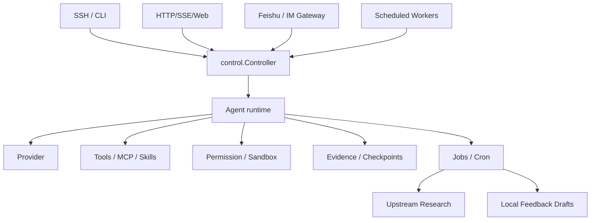

# Reames Cloud Agent 计划

> 状态：云端形态的实施设计
>
> 更新：2026-07-09
>
> 范围：云服务器、独立社交通道网关、远程 CLI、上游研究 Worker 与本地反馈工作流

## 结论

把 Reames Agent 部署到国内云服务器，并通过飞书等 IM 通道随时沟通，是可行且值得做的方向。

正确形态不是“把桌面端搬到服务器”，也不是“先开一个 Web/serve 再让所有入口依赖它”，而是在服务器上运行一个 **Reames Cloud Node**。它应像 Hermes：CLI、社交通道 gateway、Desktop 和 Web/API 是并列入口，共享 Agent 能力，但彼此进程隔离。

```text
Aliyun ECS / 自有服务器
├─ CLI / TUI
│  ├─ reames-agent
│  ├─ reames-agent run
│  └─ SSH / tmux / screen / systemd-run
├─ Gateway daemon
│  ├─ 当前：reames-agent gateway run --home "$REAMES_AGENT_HOME" --channels feishu（前台运行）
│  ├─ 兼容：reames-agent bot start --home "$REAMES_AGENT_HOME" --channels feishu（前台运行）
│  ├─ 当前：reames-agent gateway install/start/stop/status（后台服务生命周期）
│  └─ 飞书 / Lark / 微信 / QQ / Telegram 等 adapter
├─ reames-agent serve
│  ├─ HTTP/SSE/Web API
│  ├─ health/ready/metrics
│  └─ 可选远程控制面，不是 gateway 或 CLI 的前置条件
├─ Desktop（电脑本地可选）
│  └─ 本机 UI，可连接同一配置/会话能力，但不要求服务器有桌面
├─ upstream research worker
│  ├─ 检测官方上游和参考项目更新
│  ├─ 拉取差异、运行测试、生成研究报告
│  └─ 创建 Issue / 草稿 PR / 补丁建议
└─ local feedback workflow
   ├─ 管理员主动提交的用户反馈和失败案例
   ├─ 本地隐私保护与脱敏
   └─ 生成人工审阅的维护草稿
```

所有入口都应接入同一个 `internal/control` 运行边界。CLI、Server、Desktop、Gateway/Bot 只负责交互和传输，不各自实现 Agent 行为。

## 形态澄清：CLI 与 Gateway 是并列入口

云端部署应该像 Hermes：把 Agent 安装到服务器后，用户 SSH 上去可以像在自己电脑上一样运行 CLI；同时，社交通道 gateway 可以作为后台服务常驻，二者互不干扰。

```bash
reames-agent
reames-agent run "检查这个仓库并修复失败测试"
tmux new -s reames
reames-agent feedback submit --home "$REAMES_AGENT_HOME" --message "记录一个需要复盘的问题"
reames-agent feedback summary --home "$REAMES_AGENT_HOME"
reames-agent feedback draft --home "$REAMES_AGENT_HOME" --limit 20
```

社交通道的目标形态不是占用这个 CLI 终端，而是独立后台服务：

```bash
# 当前 Reames 可用的前台调试入口
reames-agent gateway setup --home "$REAMES_AGENT_HOME" --channel feishu \
  --app-id APP_ID --app-secret-env FEISHU_BOT_APP_SECRET \
  --workspace /srv/reames/project --pairing --dry-run
reames-agent gateway setup --home "$REAMES_AGENT_HOME" --channel feishu \
  --app-id APP_ID --app-secret-env FEISHU_BOT_APP_SECRET \
  --workspace /srv/reames/project --pairing
reames-agent gateway doctor --deep --home "$REAMES_AGENT_HOME"
reames-agent gateway run --home "$REAMES_AGENT_HOME" --channels feishu
reames-agent bot start --home "$REAMES_AGENT_HOME" --channels feishu

# Hermes-like 后台服务入口
reames-agent gateway install --start-now --home "$REAMES_AGENT_HOME"
reames-agent gateway status
```

`serve` 不是必须入口，它只是给 Web UI、HTTP/SSE 客户端、健康检查和反向代理使用的控制面。飞书等 IM 通道应由 gateway daemon 承载，而不是依赖 `serve`。

因此实施优先级应是：

1. **CLI/TUI**：单二进制、服务器用户、`REAMES_AGENT_HOME`、真实 API key、SSH/tmux 交互、`run` 命令闭环。
2. **Gateway service**：飞书/微信/QQ/Telegram 等平台 adapter 在后台常驻，把消息转到同一套服务器会话。
3. **Serve/Web**：需要浏览器控制台或外部客户端时再开启，默认只监听 loopback 并启用鉴权。
4. **后台 Worker**：上游研究、遥测反馈、定时任务等长期自动化。

## 目标场景

### 随时随地和云端 AI 沟通

用户在飞书或类似 IM 中发送消息，云服务器上的 Reames Gateway daemon 收到任务后：

1. 建立或恢复远端会话。
2. 绑定默认工作区或用户选择的项目。
3. 调用同一套模型、工具、权限、沙箱和证据账本。
4. 把普通回答、工具进度、审批请求、取消结果和完成证据回传到 IM。

第一优先渠道建议是飞书，因为它更适合国内使用、支持卡片交互，也与当前 `internal/bot` / `internal/botruntime` 的方向一致。这里的产品对象应叫 gateway service；`bot` 是当前实现包名和前台命令，不应限制长期命名。

### 服务器终端和 CLI 交互

云端部署不应依赖 IM。服务器上仍然需要支持：

```bash
reames-agent
reames-agent run "审查这个仓库并给出风险"
tmux new -s reames-agent
reames-agent gateway run --home "$REAMES_AGENT_HOME" --channels feishu
reames-agent serve
reames-agent upstream watch
```

SSH 终端是最可靠的兜底入口；IM 是移动端和日常触达入口；Server/Web 是后续 Web 控制台和远程客户端入口。

### 自动研究上游和参考项目

当前仓库已经有 GitHub Actions 版 Upstream Watch。云端增强版应当从“发现更新”升级为“研究更新”：

```text
定时触发
→ 拉取 Reasonix 主上游和参考项目官方仓库
→ 与 baseline / reviewed / latest_seen 对比
→ 分类变化：安全、Provider、工具、桌面、协议、文档、依赖
→ 在隔离 workspace 中尝试移植或验证
→ 运行相关测试和构建
→ 生成研究报告
→ 创建或更新 Issue
→ 必要时创建草稿分支 / 草稿 PR
→ 等待用户或维护者审批
```

重要边界：

- 不自动合并上游源码。
- 不自动发布。
- 不把参考项目当成可直接拼接的代码来源。
- 上游升级必须留下差异、测试、许可证和采纳理由。
- 涉及代码修改时，先进入草稿分支或补丁建议，再由用户或维护者决定。

### 本地反馈和 BUG 汇总

云端节点可以维护本机反馈账本，但它不是 Reames 自有遥测服务：

- Desktop 不发送启动、性能、metrics 或 crash 数据；脱敏诊断只能由用户复制或保存到本机。
- `feedback submit` 和 loopback `serve` API 只写部署节点自己的 JSONL，不连接 Reames 或第三方 endpoint。
- 管理员主动反馈可以附带可选上下文，并在落盘前脱敏。
- 反馈聚合后只生成本地 Issue 草稿、回归测试建议或修复任务，发布前必须人工审阅。

## 分层架构



云端能力必须复用本地 Agent 的权限和证据模型。不能为了“远程方便”绕过审批、沙箱、检查点或密钥脱敏。

## 安全边界

云端节点比本地桌面风险更高，必须先建立边界再开放能力：

1. **身份认证**：HTTP/Web/API 必须有 token、session 或 OAuth；IM 必须有 allowlist、管理员、审批人。
2. **最小权限密钥**：Provider Key、GitHub Token、飞书密钥、部署密钥分开配置；GitHub Token 只给需要的 repo 和权限。
3. **任务隔离**：上游研究、用户项目、临时下载和构建产物使用独立 workspace。
4. **审批策略**：写文件、执行命令、推送分支、创建 PR、改部署配置都应有可审计审批。
5. **网络出口控制**：默认允许官方上游、模型供应商和配置的服务；高风险下载和脚本执行需要记录。
6. **提示词隔离**：飞书、HTTP header、用户 ID、chat ID、系统诊断不进入稳定 provider prompt。
7. **审计日志**：记录谁在什么渠道触发了什么任务、用了哪些工具、产生了哪些副作用。
8. **回滚策略**：代码变更有 Git 分支；文件变更有 checkpoint；服务升级有 systemd/Docker 回滚。

## 实施路线

### C0：云端部署基线

- 明确 Linux amd64 构建产物、服务器用户和 `REAMES_AGENT_HOME` 配置目录。
- 提供 SSH/CLI-first 部署说明：安装二进制、写入 `<Reames Agent home>/.env`、交互式 CLI、`run`、tmux 长任务。
- 补齐阿里云 ECS 部署说明：安全组、systemd、Docker Compose、Nginx/TLS、日志和备份。
- 提供 `serve` / `gateway run` / `run` 三种入口的最小健康检查。
- 验证 DeepSeek API Key 只来自服务器环境变量或加密凭据，不写入仓库。
- credential-free 预检已用同一隔离 home 纵向验证实际 CLI 二进制的一次性
  localhost Provider 任务、会话持久化、Gateway 配置/诊断/service plan 和
  feedback 本地维护草稿；真实 Linux service-manager 与 Provider 仍需云节点补证。

完成门槛：一台干净 Linux 服务器可以启动 `serve`，SSH 可以运行 `reames-agent run`，健康检查通过。

### C1：Gateway service 闭环

- 飞书消息进入云端 Gateway service，而不是占用用户的 CLI 终端。
- 支持文本任务、状态查询、取消、审批和会话恢复。
- IM 用户、群、项目 workspace 和审批角色可配置；`gateway setup` 已为
  飞书/Lark、QQ、微信和 Telegram 提供 fail-closed、幂等、原子且脱敏的无界面配置事务，
  credential-free smoke 已执行 setup → doctor → service-plan；下一步是在干净
  Linux 云节点执行 service install/start/status/restart/status 实战。
- 飞书卡片只承载交互，不污染模型 prompt。
- 建立 Linux systemd / Windows Scheduled Task / macOS launchd 的后台服务安装、启动、停止和状态查询。

完成门槛：用户可在飞书中完成一次需要工具审批的真实任务，并能在服务器日志和证据账本中复核。

### C2：云端后台任务

- 将 `cron` / `jobs` 用作长期任务调度基础。
- 建立任务状态、日志、产物和失败重试。
- 支持从 CLI、HTTP 和 IM 查询后台任务。

完成门槛：云端可以稳定运行每日 Upstream Watch，并把结果写入报告或 Issue。

### C3：上游研究 Worker

- 在云端克隆和更新官方上游与参考项目。
- 对变化生成研究包：commit、diff、文件分类、可能影响、测试建议。
- 对高价值变化创建 Issue；必要时创建草稿分支或草稿 PR。
- 接受用户通过 IM 或 GitHub Issue 下达“研究 / 忽略 / 接受 reviewed”的决定。

完成门槛：Reasonix 或参考项目更新后，云端自动产出可审查报告，但不会自动合并。

### C4：本地反馈与维护草稿

- 当前已具备第一阶段：`serve` 提供 `POST /api/feedback`、`GET /api/feedback/summary` 和 `POST /api/feedback/draft`，`reames-agent feedback submit|summary|draft --home PATH` 提供 SSH/CLI 运维入口；两者都使用 `<Reames Agent home>/feedback/feedback.jsonl`，并在落盘前脱敏邮箱、用户路径、API key、Bearer token、JWT 和长 token；维护草稿写入 `<Reames Agent home>/feedback/drafts/*.md`，不自动外发。credential-free 预检已证明两条重复 Gateway 反馈聚为一个 group、本地草稿落盘且 fixture 敏感值不进入证据。
- Desktop 启动、性能、metrics 与 crash 上传已永久删除；本节不建设项目自有收集服务器。
- 将重复失败聚类为 Issue 或维护任务。
- 为 CLI、Server 和 Gateway 的管理员主动反馈使用同一套本地 schema。

完成门槛：管理员主动提交的一次用户反馈可以被汇总、去重，并转为可执行维护项。当前已有 HTTP 和 CLI 两条本地维护草稿生成路径；GitHub Issue 发布始终保持人工确认，不再要求 Desktop/Gateway 自动上报或专用云节点。

### C5：加固与运维

- 备份、恢复、日志轮转、升级回滚。
- 限流、封禁、审计导出。
- 沙箱强化：容器、低权限用户、工作区配额。
- 公开部署前的安全审计清单。

完成门槛：云端节点可以长期运行，不依赖人工盯守，也不会因为单个任务失败拖垮服务。

## 与现有文档和模块的关系

- 产品定位见 [PROJECT.md](PROJECT.md)。
- 总体优先级见 [DEVELOPMENT_PLAN.md](DEVELOPMENT_PLAN.md) 的 M6/M7。
- 部署命令入口见 [DEPLOY.md](DEPLOY.md)。
- IM 通道使用见 [BOT_GUIDE.zh-CN.md](BOT_GUIDE.zh-CN.md)。
- 上游发现机制见 [upstreams/README.md](upstreams/README.md)。
- 参考项目吸收规则见 [REFERENCE_GOVERNANCE.md](REFERENCE_GOVERNANCE.md)。

本计划不替代 M1/M2。云端形态依赖真实任务闭环和统一控制面，因此实施顺序应是：

```text
M1 真实任务闭环
→ M2 统一 Controller 控制面
→ C0/C1 云端部署和 Gateway service 闭环
→ C2/C3 后台任务与上游研究
→ C4/C5 遥测反馈和长期运维
```
